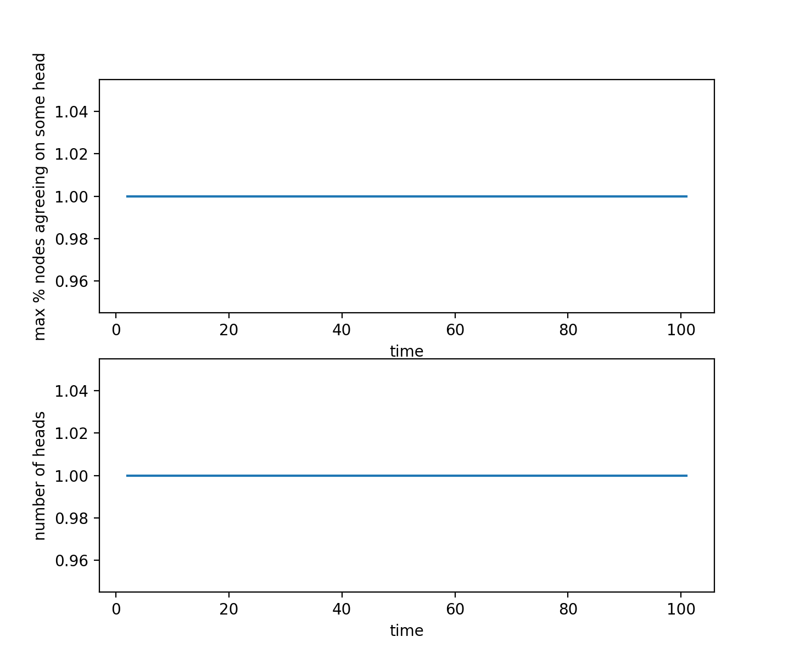
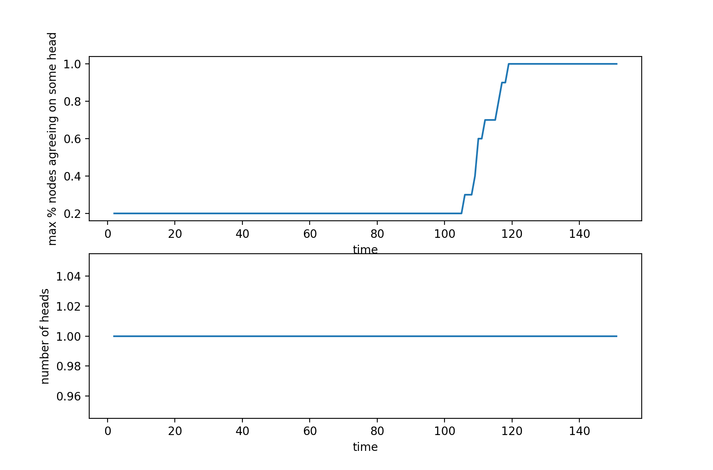
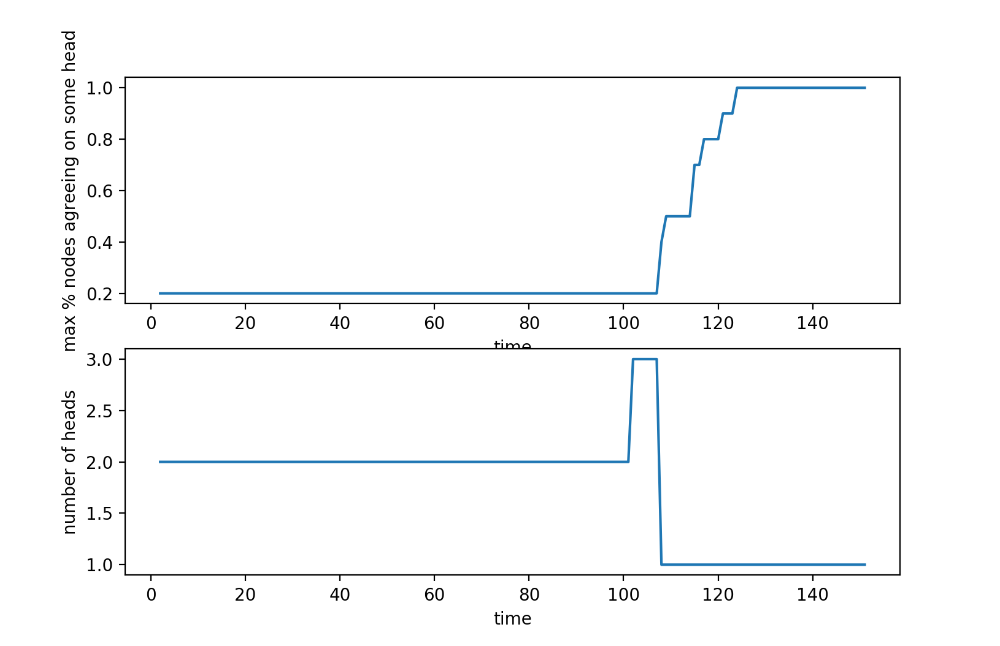
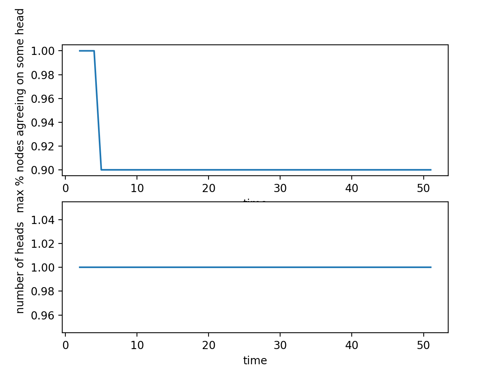
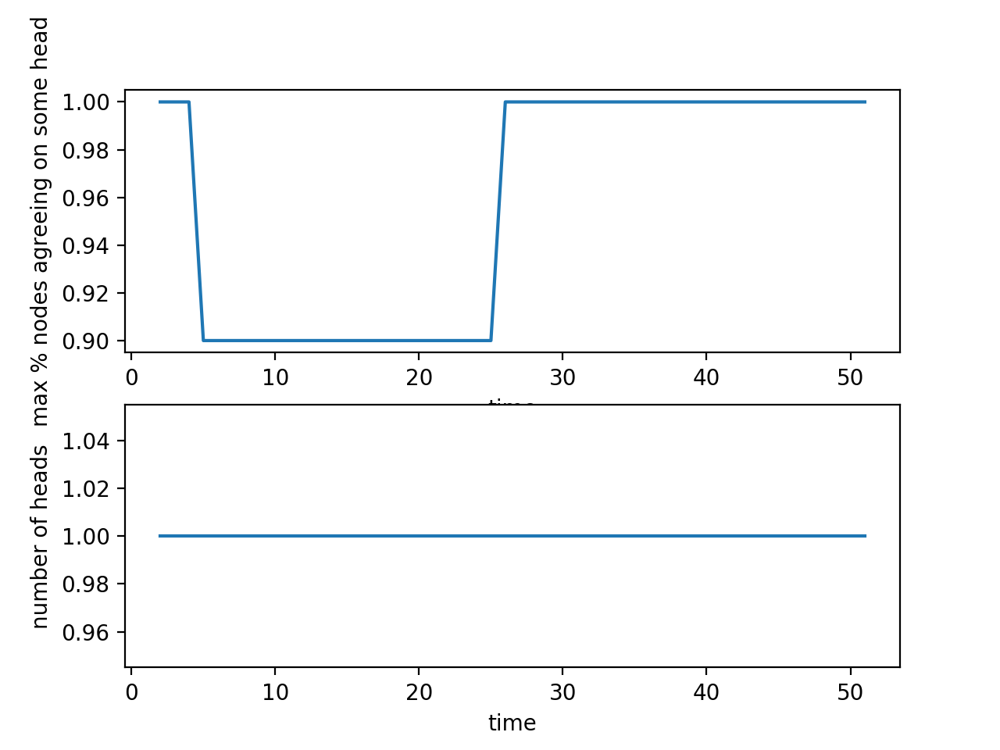
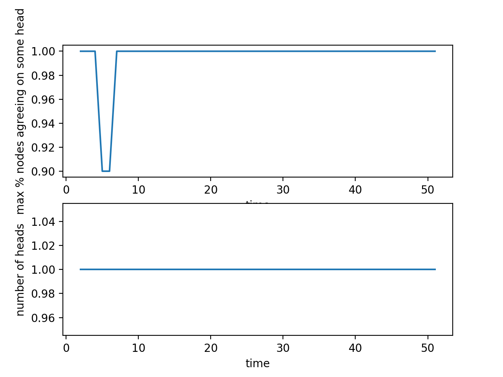
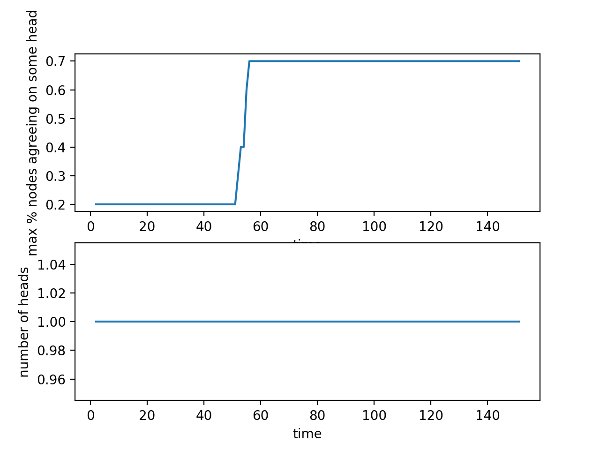
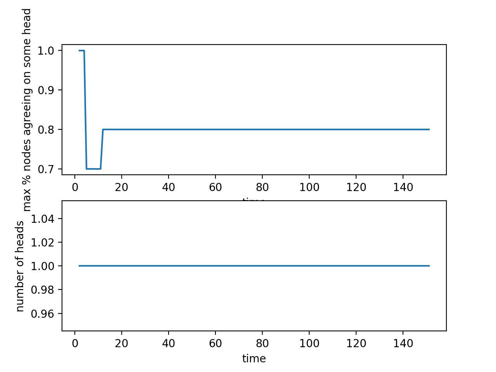
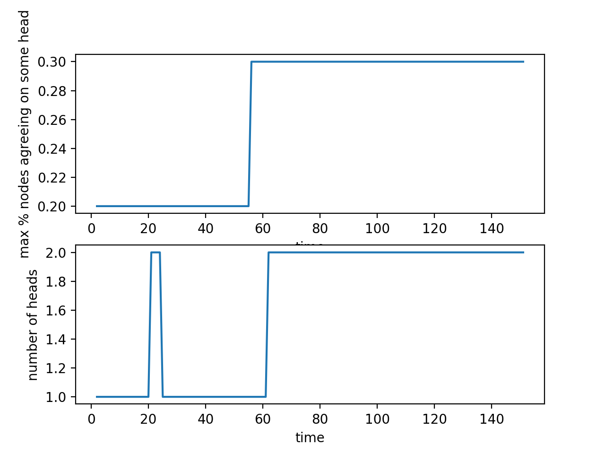
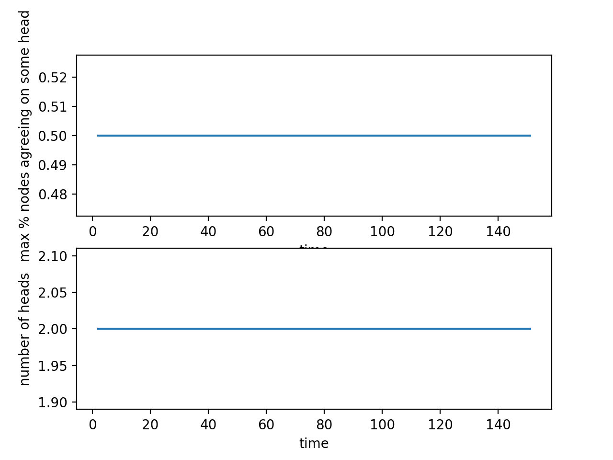

# Horizen
A simulation of how the blockchain network behaves under different conditions with [Horizen's proposal](https://www.horizen.global/assets/files/A-Penalty-System-for-Delayed-Block-Submission-by-Horizen.pdf) -- a modified Satoshi consensus using a penalty system for delayed block submission to enhance protection against 51% attacks. 

## Model 1 - No delays no attacks

This is an ideal situation:

- There are no network delays:
  - Every block gets processed as soon as the node submits the block to the blockchain
  - Every node always sees the most updated version of the blockchain
- Nodes are behaving consistently:
  - Honest nodes are always honest
  - Malicious nodes are mining their own chain and trying to overtake the main chain through a 51% attack

**Result**: The protocol appears to be working in the way it is described, and a chain split has not been observed

## Model 2 - Delays, no attacks

Removing the guarantee of no network delays:

- Assume that all nodes are behaving honestly
- Due to network delays, nodes might be adding "old blocks" to the main chain with a non-malicious intent, and these blocks have penalty associated with them

**Implementation Assumptions**: Organize the nodes into a network where the propagation of information along different edges takes an varying amount of time (determined randomly from a range), and nodes always send and receive information along the fastest routes (shortest paths). Essentially, in this model, the nodes don't always receive the most up-to-date information about the blocks being added to the chain.

**Result**: Even with delays, given a sufficiently long "wait period" where no new blocks are being added, the nodes will eventually "catch up" with the information and reach consensus:

If the delay is sufficiently high, the blockchain may be very not converge at first; however, it will converge if given enough time for the network to settle (i.e. no new nodes are added to the blockchain)

## Model 3 - One attacking group, delays and no delays

There's one malicious node attempting to cause a chain reorganization. 

First, assume there is negligible network delay; here are the cases where the attacker has:

- <50% of the total computing power:

  

- 53% of the total computing power:

  

- 68% of the total computing power:

  

When there is significant network delay, the network may fail to reach consensus:

## Model 4 - Multiple attacking groups, delays and no delays

There are multiple malicious nodes attempting at chain reorganization.

When there are no network delays, the group of nodes with the most computing power ends up dominating, and the other groups will have no choice but to agree with the reached consensus:

In this case, 3 groups of node are trying to launch attacks, and one ends up dominating:

When there are network delays and multiple malicious nodes trying to launch 51% attacks, the network may fail to reach consensus eventually:

## Model 5 - Merging two disjoint parts of the network

Initially, two parts of the networks are disjoint. The attempt to merge them together after a certain amount of time has elapsed is not successful. Because of the large values of the delay penalties, the nodes in the two parts of the network will continue to perform as if the merge never existed.

